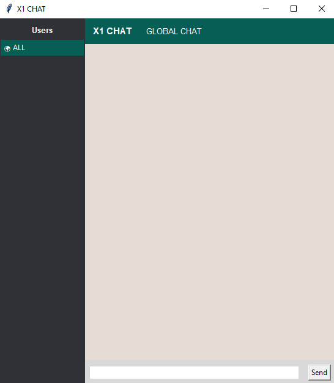

# 💬 X1 Chat App

Simple real-time chat application menggunakan Python (socket + tkinter GUI)

---

## 🚀 Features

* 🌍 Global chat (semua user)
* 🔒 Private messaging (PM antar user)
* 👥 Real-time user list
* ⌨️ Typing indicator
* 🖥️ GUI berbasis Tkinter
* ⚡ Multi-client support (threading server)

---

## 📁 Project Structure

```
x1-chat/
│
├── client/        # aplikasi client (GUI)
├── server/        # server socket
├── assets/        # (optional) screenshot
├── README.md
└── requirements.txt
```

---

## ▶️ How to Run

### 1️⃣ Jalankan Server

```bash
cd server
python main.py
```

Output:

```
🚀 Server running on port 5556
```

---

### 2️⃣ Jalankan Client

```bash
cd client
python main.py
```

---

## ⚙️ Configuration

Edit file client (biasanya di `state.py` atau config):

```python
HOST = "127.0.0.1"
PORT = 5556
```

Kalau pakai VPS:

```python
HOST = "IP_SERVER_KAMU"
PORT = 5556
```

---

## 🧠 How It Works

### 🔌 Connection

* Client connect ke server via TCP socket
* Server handle banyak client pakai threading

### 💬 Message Protocol

Semua komunikasi pakai format string:

| Type      | Format   |                  |          |          |
| --------- | -------- | ---------------- | -------- | -------- |
| Global    | `GLOBAL  | sender           | message` |          |
| Private   | `PRIVATE | sender           | target   | message` |
| Typing    | `TYPING  | sender           | target`  |          |
| User list | `USERS   | user1,user2,...` |          |          |

---

### 📡 Flow Singkat

1. Client connect → server kirim `NICK`
2. Client kirim nickname
3. Server simpan client
4. Server broadcast user list
5. Client bisa kirim:

   * global message
   * private message
   * typing status

---

## 📸 Screenshot



## 🛠️ Tech Stack

* Python 3
* Socket (TCP)
* Tkinter (GUI)
* Threading

---

## ⚠️ Notes

* Tidak menggunakan database (in-memory only)
* Chat history tidak disimpan permanen
* Cocok untuk learning project

---

## 💡 Future Improvements

* 🔐 Authentication system
* 💾 Save chat history (database)
* 🟢 Online / offline status
* 📦 JSON protocol (lebih clean)
* 🎨 UI improvement (dark mode, dll)

---

## 👨‍💻 Author

X1.X0

---

## ⭐ Support

Kalau project ini membantu, boleh kasih ⭐ di repo 😄
